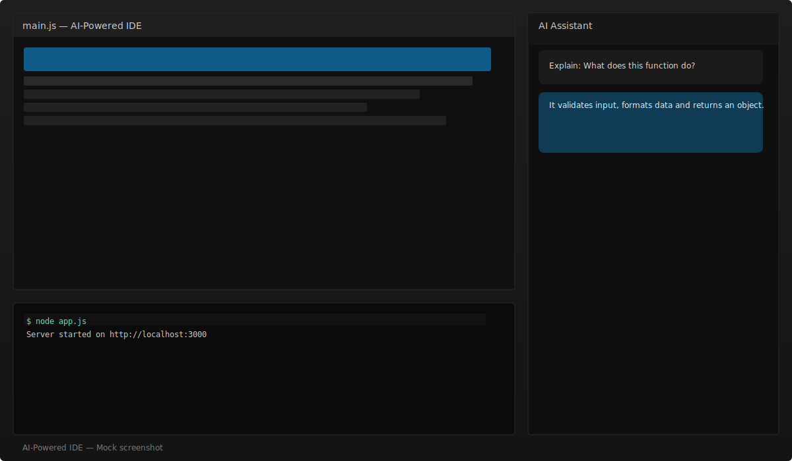

# AI-Powered IDE

An AI-powered coding IDE that integrates Monaco Editor with Google Gemini AI to provide intelligent code assistance, debugging, generation, and optimization features.

## Features

- **Code Editor**: Powered by Monaco Editor (the same editor used in VS Code) with syntax highlighting and IntelliSense for multiple programming languages
- **AI Assistant**: Leverage Google Gemini AI for:
  - Code explanation
  - Debugging assistance
  - Code generation
  - Performance optimization
- **Custom Prompts**: Send custom prompts to the AI for specific coding tasks
- **Terminal Integration**: Built-in terminal for code execution and command-line operations
- **Theme Support**: Light and dark themes with automatic system preference detection
- **Multi-Language Support**: JavaScript, Java, C++, HTML, CSS, JSON, SQL, Python, and more
- **Responsive Design**: Works on desktop and mobile devices

## Installation

1. **Clone the repository**:
   ```bash
   git clone <repository-url>
   cd AI-Powered-IDE
   ```

2. **Install dependencies**:
   ```bash
   npm install
   ```

3. **Get a Google Gemini API Key**:
   - Visit [Google AI Studio](https://aistudio.google.com/apikey)
   - Create a free API key
   - Keep this key secure and do not share it

## Usage

1. **Start the development server**:
   ```bash
   npm start
   ```
   This will start a local server on port 3000.

2. **Open in browser**:
   Navigate to `http://localhost:3000`

3. **Configure API Key**:
   - Enter your Gemini API key in the input field in the header
   - Click "Save Key" to store it locally

4. **Start Coding**:
   - Select your programming language from the dropdown
   - Write or paste code in the editor
   - Use AI buttons (Explain, Debug, Generate, Optimize) for assistance
   - Execute code using Ctrl+Enter or the terminal

   ## Screenshot

   Below is a screenshot of the current IDE layout (editor top-left, terminal bottom-left, AI assistant on the right). This is a generated placeholder image — for an exact screenshot, open the app in your browser and capture one.

   

## Keyboard Shortcuts

- `Ctrl/Cmd + E`: Explain code
- `Ctrl/Cmd + Shift + D`: Debug code
- `Ctrl/Cmd + G`: Generate code
- `Ctrl/Cmd + O`: Optimize code
- `Ctrl/Cmd + Enter`: Execute code
- `Ctrl/Cmd + ?`: Show help dialog

## Technologies Used

- **Frontend**: HTML5, CSS3, JavaScript (ES6+)
- **Editor**: Monaco Editor
- **AI Integration**: Google Gemini API
- **Build Tool**: npm scripts with `serve`
- **Styling**: Custom CSS with CSS Variables for theming

## Project Structure

```
AI-Powered-IDE/
├── index.html          # Main HTML file
├── css/
│   └── style.css       # Application styles
├── js/
│   ├── main.js         # Main application logic
│   ├── editor.js       # Monaco Editor integration
│   ├── aiService-gemini.js  # Gemini AI service
│   ├── actions.js      # AI action handlers
│   ├── simpleExecutor.js    # Code execution
│   └── terminal.js     # Terminal integration
├── package.json        # Project configuration
└── README.md          # This file
```

## Contributing

Contributions are welcome! Please feel free to submit a Pull Request.

## License

This project is open source and available under the [MIT License](LICENSE).

## Disclaimer

This IDE is for educational and development purposes. Ensure you have proper API usage limits and costs in mind when using Google Gemini API. Always review AI-generated code before using it in production.
